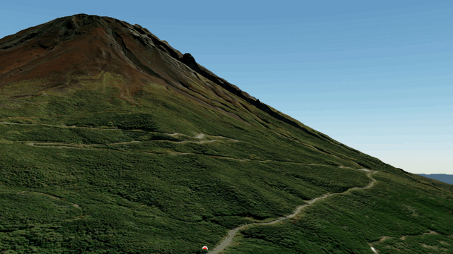
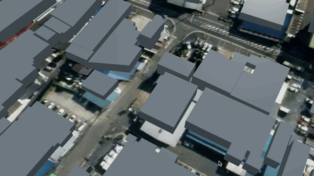
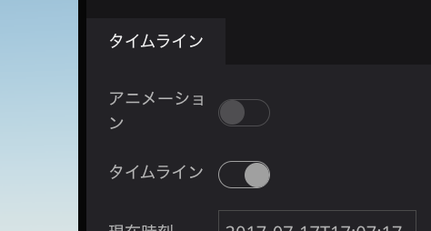
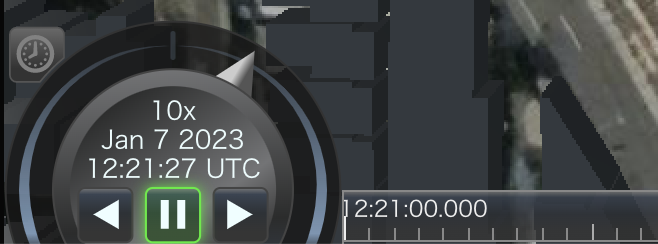
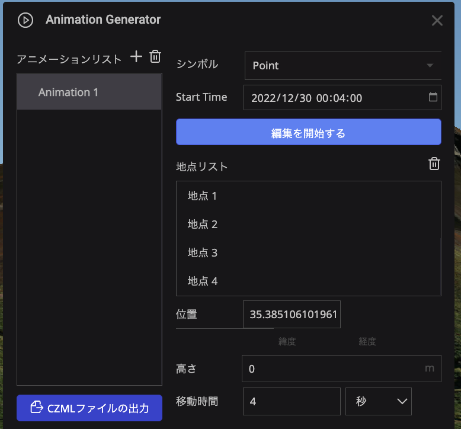
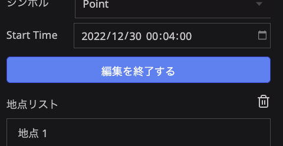

# アニメーション ジェネレーター プラグイン

## 概要
任意のポイントや画像および3Dモデルが、指定した地点間を移動するアニメーションを作成することができます。

## 使い方

### 編集画面での設定

- 画像や3Dモデルを使用する場合は、あらかじめプラグインの右メニューで使用するアセットを追加してください。
- 本プラグインを使用する際には、あらかじめシーンの設定からタイムラインを有効にしておいてください。
  
  
  

#### リストの追加方法
- Symbolリストの「+」をクリックして、リストを追加します。
- `Model`：移動させるシンボルとして3Dモデルを使用するのか画像を使用するのかを指定します。
- `Upload File`：使用する3Dモデルおよび画像をアセットから選択します。
- `Name`：ウィジェットのシンボル一覧に表示させる項目名を入力します。

### 公開ページでの操作

- アニメーションリストの「+」をクリックして、アニメーションのリストを追加します。
- 各アニメーションでは以下の項目を設定します。
  - `シンボル`：ポイント、画像アイコン、3Dモデルからアニメーションで移動するシンボルを選択します。
  - `Start Time`：アニメーションの開始日時を指定します。
  - `編集を開始する`：ボタンをクリックすると、マップのクリックすることで、移動する区間の地点を指定することができます。
    - 連続でマップをクリックすることで、複数地点を登録することができます。
    - 地点の登録を終了する場合は`編集を終了する`をクリックします。
    
  - 地点リストから地点をクリックすることで、登録したそれぞれの地点で以下の項目を設定することができます。
    - `高さ`：地点の地表面からの高さを指定します。
    - `移動時間`：前の地点からその地点までの所用移動時間を指定します。
- 地点の設定が完了し、タイムラインウィジェットからタイムラインを再生すると設定したシンボルが移動します。
- アニメーションはリストを追加することで複数同時に作成することができます。
- 作成したアニメーションは、`CZMLファイルの出力`ボタンでczmlファイルとして保存することができます。
